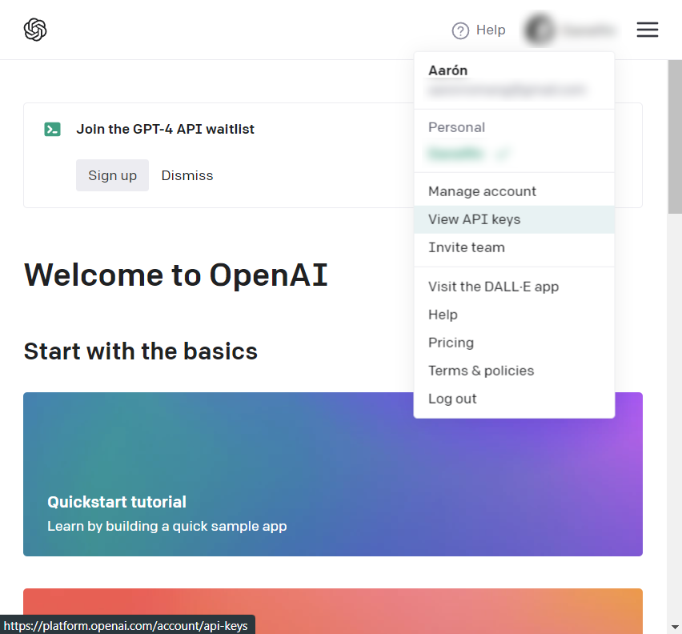

# pytest-mate


Pytest-mate is an experiment for automatically generating unit tests using the GPT API. The project's entire codebase is analyzed, and a testing file is created for each class or method.

## Setup

I recommend creating a virtual environment to install the library and its dependencies. The tests were conducted using Python 3.10.

```python
# environment
python -m venv .venv
pip install -r requirements.txt

# setup
pip install -e .
```


To obtain an OpenAI API key, you need to first navigate to the [developer page](https://platform.openai.com/overview) and log in to your account. Once logged in, you can request an API key from the dropdown menu. Please note that API queries are charged, so you will need to provide a payment method before you can make requests. Add your API Key to `.env` file



## Usage

Using the same environment

```python
cd /home/name/my_project
./pytestmate
```


## Thoughts

The results are promising, but there are still many import problems with the libraries, so a review and correction of the paths is necessary. Additionally, the system is capable of emulating mocks for complex libraries, but with some occasional bugs.

As an improvement, we could try using GPT-4 instead of GPT-3, but access to it is not yet enabled. This will likely improve the quality of the tests.
